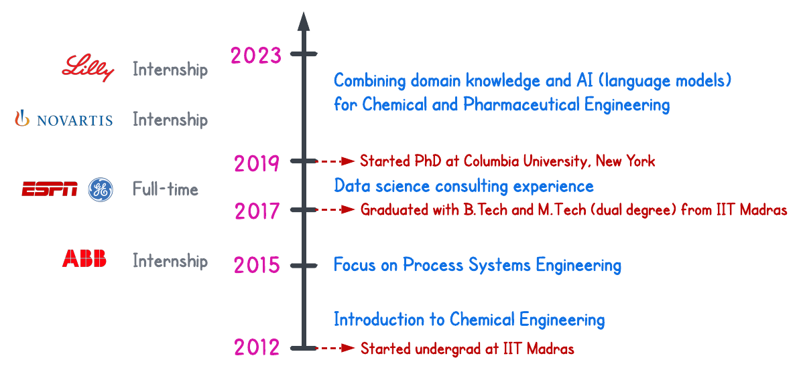

## Overview

## Teaching

<ul>
<li>Spring 2023: Systemic Risk Management, School of Professional Studies, Columbia University</li>
<li>Summer 2022: AI in Biochemical and Chemical Engineering, Denmark Technical University (DTU)</li>
<li>Fall 2021: AI in Chemical Engineering, Columbia University</li>
<li>Fall 2019: Math Methods in Chemical Engineering, Columbia University</li>
<li>Spring 2017: Introduction to Statistical Hypothesis Testing, IIT Madras</li>
<li>Fall 2016: Applied Time Series Analysis, IIT Madras</li>
</ul>

## Internships
 Pharmacokinetic-Pharmacodynamic Modeling in R&emsp;  
Advisor: Dr. Matthew Fidler, Novartis | Jun 2020 - Aug 2020 
<ul>
<li> Developed bootstrapping and autocovariate search modules for nlmixr - an open-source R package developed at Novartis for performing PK/PD modeling in R</li>
<li> Implemented stepwise covariate modeling (SCM) and LASSO-based covariate search algorithms for improving the predictive ability of models used for studying drug effects in human trials. </li>
</ul>

 Historical Data Mining and System Identification &emsp;   
Advisor: Dr. Kaushik Ghosh, ASEA Brown Boveri (ABB) Research Centre | May 2015 - Aug 2015 
<ul>
<li> Implemented a novel segment identification algorithm in MATLAB to identify 'good regions' in historical databases </li>
<li> Comparatively analyzed an iterative-autoregressive exogenous (ARX) algorithm with the existing system identification algorithm at ABB; proposed changes to make the algorithm more robust towards high noise conditions </li>
<li> Proposed unification of segment identification and iterative ARX algorithms for use in ABB's model identification toolbox </li>
</ul>

## Professional Experience
Data Scientist:<a href='https://www.espncricinfo.com/story/_/id/26312451/launching-superstats,-new-language-cricket-analysis'>Machine Learning for Sports Analytics with ESPN-cricinfo</a> &emsp; <a href='https://www.espncricinfo.com/story/_/id/26312451/launching-superstats,-new-language-cricket-analysis'> news article</a>  
Advisor: Prof. Raghunathan Rengaswamy | Nov 2018 - March 2019 &emsp;   &emsp;   
<ul>
<li> Used ESPN's ball-by-ball historical dataset for cricket matches in the past 15 years to build a machine learning tool for predicting match scores, quantifying impactful match events, and generating 'smart statistics' for players </li>
<li> Implemented a recurrent neural network (RNN) and evaluated its performance in modeling the game dynamics </li>
<li> Built modules in Python for performing optimal balls-allocation between bowlers and batsmen, estimating wicket probability at a given state, and estimating match-win probabilities by factoring in both historical data and current </li>
<li> Combined all the modules together to build an interactive match-simulation tool with quantification of impactful events </li>
<li> This tool was used by ESPN-cricinfo during the Indian Premier League 2019 and ICC World Cup 2019 worldwide </li>
</ul>

Data Scientist:Anomaly Detection and Prediction for Aluminum Smelting Operations &emsp; 
Advisor: Prof. Raghunathan Rengaswamy | July 2018 - Oct 2018  
<ul>
<li> Built an L1 trend-extraction routine in Python with built-in hyperparameter estimation module for a piecewise linear trend extraction on any general time-series signal; core of the algorithm uses CVXOPT for optimization </li>
<li> Implemented a fuzzy variant of C-means clustering on the estimated linear trends to identify sub-optimal, or anomalous operating regimes through clustering of the operating regimes based on a pre-defined optimality criterion </li>
<li> Performed subspace angle comparisons between principal vectors to assess cluster separations and derive process insights </li>
<li> Integrated all the three modules as a Python package and shipped to the end user with Sphinx generated documentation </li>
</ul>

<!-- ## Education

<ul>
 <li><b><i>2019 - present</i></b> &emsp; Ph.D. Candidate in Chemical Engineering, Columbia University, New York</li>
 <li><b><i>2017-19</i></b> &emsp;&emsp;&emsp;&emsp; Data Scientist roles with focus on Renewable Energy</li>
 <li><b><i>2017</i></b> &emsp;&emsp;&emsp;&emsp;&emsp;&emsp;Master of Technology (Dual Degree) in Chemical Engineering, IIT Madras</li>
 <li><b><i>2016</i></b> &emsp;&emsp;&emsp;&emsp;&emsp;&emsp;Bachelor of Technology (Dual Degree) in Chemical Engineering, IIT Madras</li>
</ul>

 -->
<!-- |Time|Degree|School|
|:-|:-|:-|
|09/2019 - Present | Ph.D. Candidate, Chemical Engineering | Columbia University, New York
|05/2017|Master of Technology (Dual Degree), Chemical Engineering | Indian Institute of Technology Madras
|05/2016|Bachelor of Technology (Dual Degree), Chemical Engineering |Indian Institute of Technology Madras -->

<!-- ## Teaching Assistant Positions

<ul>
<li><b>Spring 2023:</b> Systemic Risk Management, School of Professional Studies, Columbia University</li>
<li><b>Summer 2022:</b> Artificial Intelligence in Biochemical and Chemical Engineering, Denmark Technical University (DTU)</li>
<li><b>Fall 2021:</b> Artificial Intelligence in Chemical Engineering, Columbia University</li>
<li><b>Fall 2019:</b> Math Methods in Chemical Engineering, Columbia University</li>
<li><b>Spring 2017:</b> Introduction to Statistical Hypothesis Testing, IIT Madras</li>
<li><b>Fall 2016:</b> Applied Time Series Analysis, IIT Madras</li>
</ul>
 -->

<!-- ## Professional Service

|Time|Role|Organization|
|:-|:-|:-|
|2020 - Present|Reviewer|Journal of Computers and Chemical Engineering|
|2020 - Present|Reviewer|AIChE Journal|
|02/2020 - Present|Reviewer|Journal of Computers and Chemical Engineering|
 -->

<!-- ## Technical Strengths

|Category|Skills|
|:-|:-|
|Language           |Python, R, MATLAB, SQL, HTML, and LaTeX|
|Simulation         |SimuLink and Aspen HYSYS|
 -->
<!-- ## Professional Experience

 -->

<!-- <b>Modeling Enhanced Enzyme Diffusion in the Presence of Substrates</b> 
Advisor: Prof. Kyle Bishop | Sep 2019 - Nov 2019  
<ul>
<li>Modeled enhanced enzyme diffusion using a Bayesian data analysis framework in Python; used enzyme trajectories data obtained from single molecule imaging techniques for tracking enzyme movements </li>
<li> Evaluated possibility of anisotropic diffusion through a statistical hypothesis test using F-test on displacements </li>
<li>Proposed Markov-Chain Monte Carlo (MCMC) simulations combined with k-means clustering for modeling diffusion for the different enzyme oligomerization forms; obtained probabilistic distributions capturing uncertainty in the estimates </li>
<li> Demonstrated significant variations in diffusion coefficients across the possible oligomerization states of the enzyme </li>
</ul>
 -->

<!-- <b>Data Scientist:</b> <a href='https://www.espncricinfo.com/story/_/id/26312451/launching-superstats,-new-language-cricket-analysis'>Machine Learning for Sports Analytics with ESPN-cricinfo</a> &emsp; <a href='https://www.espncricinfo.com/story/_/id/26312451/launching-superstats,-new-language-cricket-analysis'> news article</a>  
Advisor: Prof. Raghunathan Rengaswamy | Nov 2018 - March 2019 &emsp;   &emsp;   
<ul>
<li> Used ESPN's ball-by-ball historical dataset for cricket matches in the past 15 years to build a machine learning tool for predicting match scores, quantifying impactful match events, and generating 'smart statistics' for players </li>
<li> Implemented a recurrent neural network (RNN) and evaluated its performance in modeling the game dynamics </li>
<li> Built modules in Python for performing optimal balls-allocation between bowlers and batsmen, estimating wicket probability at a given state, and estimating match-win probabilities by factoring in both historical data and current </li>
<li> Combined all the modules together to build an interactive match-simulation tool with quantification of impactful events </li>
<li> This tool was used by ESPN-cricinfo during the Indian Premier League 2019 and ICC World Cup 2019 worldwide </li>
</ul>
 -->

<!-- <b>Data Scientist:</b> Anomaly Detection and Prediction for Aluminum Smelting Operations &emsp; 
Advisor: Prof. Raghunathan Rengaswamy | July 2018 - Oct 2018  
<ul>
<li> Built an L1 trend-extraction routine in Python with built-in hyperparameter estimation module for a piecewise linear trend extraction on any general time-series signal; core of the algorithm uses CVXOPT for optimization </li>
<li> Implemented a fuzzy variant of C-means clustering on the estimated linear trends to identify sub-optimal, or anomalous operating regimes through clustering of the operating regimes based on a pre-defined optimality criterion </li>
<li> Performed subspace angle comparisons between principal vectors to assess cluster separations and derive process insights </li>
<li> Integrated all the three modules as a Python package and shipped to the end user with Sphinx generated documentation </li>
</ul>
 -->

<!-- <b>Optimal Filtering using PCA based Dynamic Models</b> 
Advisor: Prof. Arun Tangirala and Prof. Shankar Narasimhan | June 2016 - May 2017
<ul>
<li> Studied and implemented a novel identification technique called dynamic iterative principal component analysis (DIPCA) in MATLAB that takes in process data and estimates model order, parameters, and measurement error variances </li>
<li> Proposed a layered optimal data reconciliation and model validation approach based on an errors-in-variables Kalman-filter to handle dynamic input-output variables that the principal component analysis (PCA) framework is unable to handle </li>
<li> Demonstrated efficacy of this approach on a physical 'two-tank liquid level' case study in obtaining noise-free variable estimates and performing a selective model validation similar to residual analysis in classical system identification </li>
</ul>
 -->

<!-- 

 <b>Research Internship:</b> Pharmacokinetic-Pharmacodynamic Modeling in R&emsp;  
Advisor: Dr. Matthew Fidler, Novartis | Jun 2020 - Aug 2020 
<ul>
<li> Developed bootstrapping and autocovariate search modules for nlmixr - an open-source R package developed at Novartis for performing PK/PD modeling in R</li>
<li> Implemented stepwise covariate modeling (SCM) and LASSO-based covariate search algorithms for improving the predictive ability of models used for studying drug effects in human trials. </li>
</ul>

 <b>Research Internship:</b> Historical Data Mining and System Identification &emsp;   
Advisor: Dr. Kaushik Ghosh, ASEA Brown Boveri (ABB) Research Centre | May 2015 - Aug 2015 
<ul>
<li> Implemented a novel segment identification algorithm in MATLAB to identify 'good regions' in historical databases </li>
<li> Comparatively analyzed an iterative-autoregressive exogenous (ARX) algorithm with the existing system identification algorithm at ABB; proposed changes to make the algorithm more robust towards high noise conditions </li>
<li> Proposed unification of segment identification and iterative ARX algorithms for use in ABB's model identification toolbox </li>
</ul>
 -->

<!--  <b>SARIMA modeling and Speech Data Analysis using Spectrogram</b> 
Advisor: Prof. Arun Tangirala | July 2015 - Dec 2015
<ul>
<li> Modeled monthly measles cases reported in New York City for the last 44 years using R as a Seasonal ARIMA model </li>
<li> Implemented spectrogram approach in R to separate noise from an overlapping amplitude and frequency modulated signal </li>
</ul>

 -->
